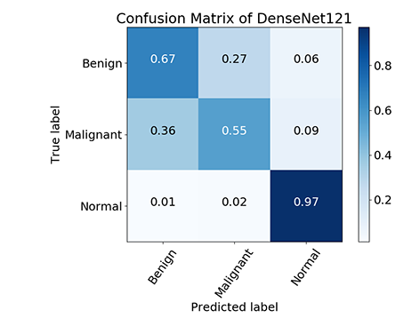
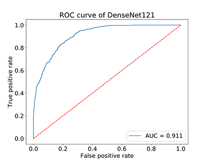

# Breast Cancer classifier 

## Introduction
This implement is aimed at achieving a breast cancer classifier. CNNs and transfer learning are used. Dataset is mammography.

## Environment
- python==3.6.10
- cudatoolkit==10.0.130
- cudnn==7.6.0
- tensorflow-gpu==2.0.0
- keras==2.3.1
- numpy==1.16.6
- opencv
- matplotlib
- scikit-learn
- pandas
- pillow
- h5py
- tqdm
- pycm

## Data preparation
You can use public mammography datasets such as [MIAS](http://peipa.essex.ac.uk/pix/mias/), [DDSM](http://www.eng.usf.edu/cvprg/Mammography/Database.html) and [CBIS-DDSM](https://wiki.cancerimagingarchive.net/display/Public/CBIS-DDSM).  <br>(The CBIS-DDSM dataset is an updated and standardized version of the DDSM dataset.)

You need to convert mammography into .png format and split dataset into train, val and test set.

- MIAS: .pmg --> .png<br>Read images using PIL and save them as .png format directly.

- DDSM: .LJPEG --> .png<br>Refer to [this blog](https://blog.csdn.net/liuxinghan1998/article/details/91493334?depth_1-utm_source=distribute.pc_relevant.none-task&utm_source=distribute.pc_relevant.none-task)

- CBIS-DDSM: .dcm-->.png<br> run this bash file.
````bash
#!/bin/bash
# This script is used to find .dcm files and convert them into 16-bit .png files
OLDIFS="$IFS"
IFS=$'\n'
picname=$(find $'E:/CBIS-DDSM' -name '*.dcm')    
for file in $picname   
do    
	echo $file
	dcmj2pnm +on2 $file ${file%.*}.png	  
done  
IFS="$OLDIFS"
`````````
Your directory tree should be like this:
````bash
$CODE_ROOT
├── train
│   ├── norm
│   ├── benign
│   └── malignant
│  
├── val
│   ├── norm
│   ├── benign
│   └── malignant
│  
├── test
│   ├── norm
│   ├── benign
│   └── malignant
│  
````
## Train and test
Train cnn models on train set. A new .h5 file will be generated after completion of training.
````bash
python train_densenet.py
or python train_dpn.py
````

Evaluate trained model on test set. ROC curve, confusion matrix and some indexes in classification can be achieved.
````bash
python test.py --input_model 'trained-model-name' --save_name 'target-save-name'
````

## Results


